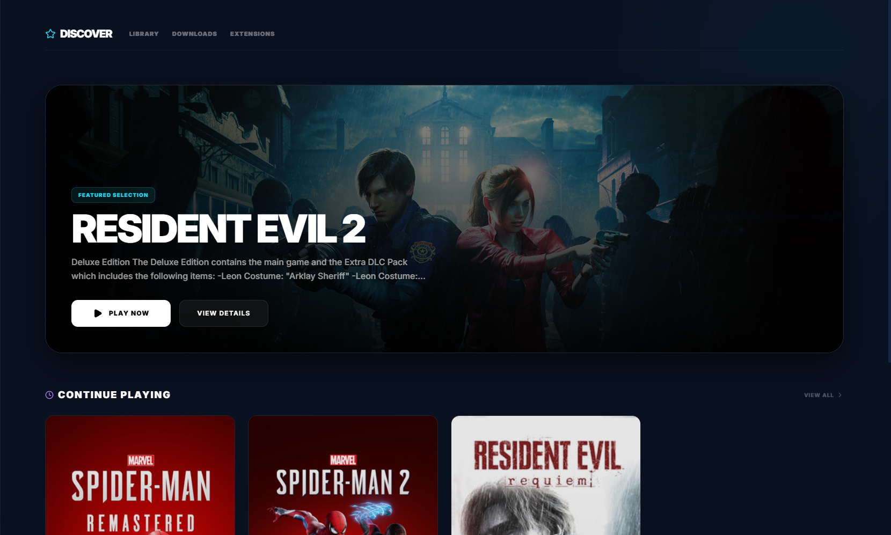
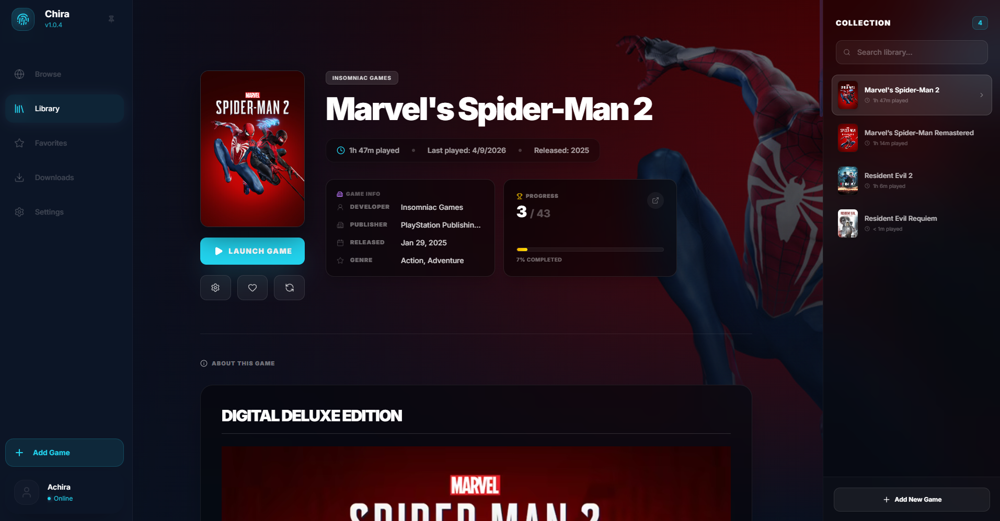
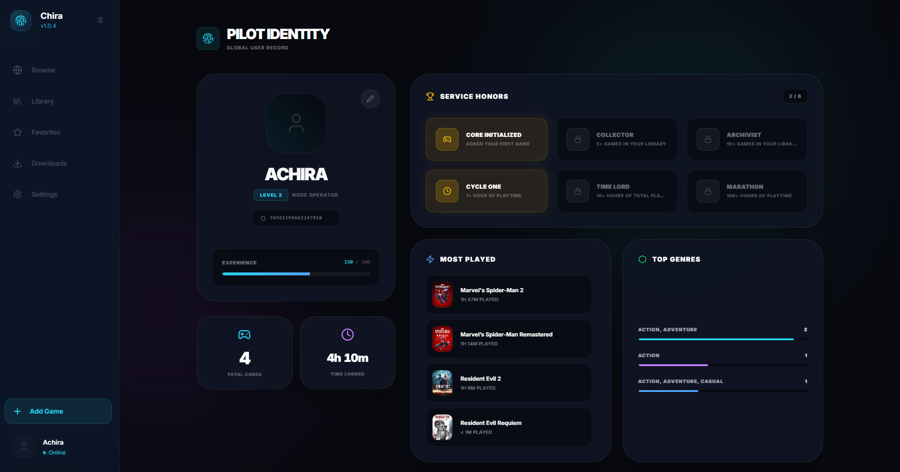

# ChiraLauncher

A personal game launcher built with Tauri, Rust, and React. ChiraLauncher lets you organize and launch your entire game collection from one place, track your playtime, pop achievements in a live overlay, and pull rich metadata from Steam — all without requiring a Steam account or any DRM.

---

## What it does

- **Library management** — Add games manually, scan folders automatically, or import them from existing installations. Every game lives in a local SQLite database you fully control.
- **Steam metadata sync** — Enter a Steam App ID and the launcher fetches the game's description, cover art, background image, logo, genres, system requirements, and user reviews directly from Steam's API. Everything is cached locally so it works offline after the first sync.
- **Achievement tracking** — ChiraLauncher reads achievement data from `steam_settings/achievements.json` (the standard format used by most offline achievement emulators). It tracks unlock status, timestamps, and pulls global completion percentages from Steam's API to show rarity tiers.
- **Live overlay** — When you launch a game, a transparent overlay window appears in the corner showing a "Now Playing" toast with the game's cover art. Unlocked achievements pop up in real time during your session.
- **Playtime tracking** — The launcher monitors the game process and automatically accumulates playtime to the second. Works for both normal and administrator-elevated processes.
- **Graceful process management** — Stopping a game sends a proper WM_CLOSE message to the window first (giving it a chance to save), then force-kills if it doesn't respond within 2 seconds.
- **Custom themes** — The accent color is configurable per user. An extension system lets you apply full CSS themes.
- **Borderless fullscreen helper** — One-click button to strip a game's window chrome and stretch it to fill the screen, with the overlay staying on top.
- **Repack database** — Includes a searchable index of FitGirl repacks so you can quickly find where to grab a game.

---

## Recent Updates

### 🚀 v0.1.7 Release Notes

**✨ New Features & UI Overhauls**
- **All-New Audio Tab:** Added a dedicated spot in Settings to manage launcher sounds. Set your own universal background music, change the default achievement pop sound, and adjust live volume sliders.
- **Audio Previews:** Hooking up custom sounds is great, but having to guess if they work isn't. Added inline "Play" buttons next to sound pickers to test them out immediately.
- **Messaging Facelift:** Completely redesigned the chat UI with a clean left-aligned layout and clear styling for sent and received messages.
- **Easier Encryption:** Generating E2E encryption keys is now painless with a quick "Generate Keys" button integrated directly into the chat view.
- **Cleaner Library Info:** Swapped out giant info cards for sleek, backdrop-blurred pill tags that cleanly show the developer, publisher, ID, and other details.
- **Collapsible Game Descriptions:** Game descriptions are now collapsible by default. They fade out cleanly with a "Read More" button to keep game pages uncluttered.
- **Taming the Downloads Page:** Automatically groups multi-part `.rar` downloads into a single, neat folder card. Click "View Contents" to check the progress of individual files.
- **System Tray Polish:** Cleaned up the shadow on the system tray menu and added a pulsing green dot to show which games are currently running in the background.

**🐛 Bug Fixes & Stability**
- **Achievement Sound Stacking:** Fixed an issue where unlocking multiple achievements at the exact same time would spawn overlapping audio instances, drastically increasing the volume. A smart 500ms throttle ensures the pop sound plays only once while keeping toasts perfectly synced.
- **"DJ Launcher" Bug Fixed:** The audio engine now instantly cuts the old track when you switch games quickly, preventing multiple tracks from playing on top of each other.
- **Achievements Pop Even When Muted:** Reworked how the audio context handles muting, ensuring your background music stays quiet while achievement pops still come through.
- **No More Free XP:** Patched the "Test Achievement" developer buttons to strictly send 0 XP and flag as debug events, preventing them from altering cloud profiles.
- **Smarter Desktop Shortcuts:** Added a slight boot delay when launching via a desktop shortcut so the database and UI have time to wake up fully before passing the launch command.

**⚡ Performance & Under-the-Hood**
- **Focus-Aware Music:** Background music will now smoothly fade out the second you minimize the window, click away, or launch a game, and smoothly fade back in when you return.
- **Dynamic Notification Timing:** The engine now calculates exactly how long your custom `.mp3` or `.wav` is, trims out dead air, and keeps the toast on screen for the whole sound (with a 3-second minimum).
- **Better Local Audio Handling:** Wrote a new Rust command to pipe audio byte data directly to the frontend, completely bypassing Tauri's strict local file webview restrictions.

---

## Screenshots

> 

> 

> 

---

## Requirements

Before building or running ChiraLauncher from source, you need the following installed:

### Core tools

- **Rust** (latest stable) — https://rustup.rs  
  After installing, run `rustup update stable` to make sure you're on the latest.

- **Node.js 18 or newer** — https://nodejs.org  
  npm is included with Node.js. Yarn or pnpm will also work but the lockfile is npm.

- **Tauri CLI** — Install via Cargo after Rust is set up:
  ```
  cargo install tauri-cli
  ```

### Windows-specific (required on Windows)

- **WebView2 Runtime** — Comes pre-installed on Windows 10 (version 1803+) and Windows 11. If it's missing, download it from Microsoft's website.
- **Visual Studio Build Tools** — Required by Rust's MSVC toolchain. Install "Desktop development with C++" from the Visual Studio Installer.
- **Windows SDK** — Usually installed automatically alongside the build tools.

### Optional but recommended

- **Git** — For cloning the repo. https://git-scm.com

---

## Installation (pre-built release)

1. Go to the [Releases](https://github.com/AchiraStudio/ChiraLauncher/releases) page.
2. Download the latest `.msi` installer (Windows) or `.exe` setup file.
3. Run the installer. Windows may show a SmartScreen warning because the app is unsigned — click "More info" → "Run anyway".
4. Launch ChiraLauncher from the Start menu or desktop shortcut.
5. On first launch, the app will ask you to set up your profile name. That's it.

---

## Building from source

### 1. Clone the repository

```bash
git clone https://github.com/AchiraStudio/ChiraLauncher.git
cd ChiraLauncher
```

### 2. Install frontend dependencies

```bash
npm install
```

### 3. Run in development mode

This starts both the Vite dev server and the Tauri window simultaneously with hot reload:

```bash
cargo tauri dev
```

The first run will take a few minutes because Cargo is compiling all Rust dependencies from scratch. Subsequent runs are much faster.

### 4. Build a production binary

```bash
cargo tauri build
```

This will:
- Compile the frontend with Vite
- Compile the Rust backend in release mode
- Bundle everything into an installer in `src-tauri/target/release/bundle/`

The output on Windows will be an `.msi` and a standalone `.exe` in subdirectories of the bundle folder.

---

## Project structure

```
ChiraLauncher/
├── src/                        # React + TypeScript frontend
│   ├── App.tsx                 # Root component, Tauri event bridge
│   ├── Library.tsx             # Library page (main game detail view)
│   ├── Browse.tsx              # Discover/home page
│   ├── components/
│   │   ├── layout/             # Sidebar, AppLayout
│   │   ├── modals/             # Add/Edit game, scanner, etc.
│   │   ├── game/               # AchievementGrid, GameCard
│   │   └── ui/                 # ContextMenu, DownloadManager, etc.
│   ├── hooks/                  # useLocalImage, etc.
│   ├── services/               # Steam API, game launch, achievement fetch
│   ├── store/                  # Zustand state (games, UI, process, profile)
│   └── types/                  # TypeScript interfaces
│
├── src-tauri/                  # Rust backend (Tauri app)
│   ├── src/
│   │   ├── lib.rs              # Command registration, app setup
│   │   ├── state.rs            # Shared application state
│   │   ├── db/                 # SQLite schema, queries, migrations
│   │   ├── commands/           # Tauri command handlers
│   │   ├── achievements/       # Achievement parsing and resolution
│   │   ├── achievement_watcher.rs  # File watcher for live unlock detection
│   │   ├── metadata/           # Image cache, Steam metadata fetching
│   │   ├── process/            # Process monitoring and identity
│   │   └── profile.rs          # User profile management
│   ├── tauri.conf.json         # Tauri app configuration
│   └── Cargo.toml              # Rust dependencies
│
├── public/                     # Static assets served by Vite
├── index.html                  # Main HTML entry point
└── package.json                # Node dependencies and scripts
```

---

## How to use

### Adding games

There are three ways to add a game:

**Manual** — Click "Add Game" in the sidebar. Fill in the title, point to the `.exe`, and optionally add a Steam App ID to pull metadata. You can paste image URLs for cover art and background, or upload local files.

**Folder scan** — Click "Scan Folders" and pick a directory. The scanner looks for executables and suggests games to import. It tries to detect Steam App IDs from `steam_settings/steam_appid.txt` automatically.

**Right-click context menu** — Once a game is in your library, right-click it in the sidebar for quick actions like "Edit Metadata", "Sync Metadata", "Open Location", or "Remove Game".

### Syncing metadata

1. Open a game in the Library.
2. Click the pencil/edit icon (or right-click → Edit Metadata).
3. Enter the Steam App ID for the game (you can find this in the Steam store URL: `store.steampowered.com/app/XXXXXX/`).
4. Click "Sync from Steam". The launcher will fetch the description, images, genres, system requirements, reviews, and logo.
5. All assets are downloaded to a local image cache directory so they persist offline.

### Achievement tracking

ChiraLauncher reads achievements from the file `steam_settings/achievements.json` inside the game's install directory. This is the standard format written by achievement emulators (such as Goldberg's Steam emulator).

The file format it supports:

```json
[
  {
    "name": "ACH_WIN_ONE_GAME",
    "earned": true,
    "earned_time": 1712345678
  }
]
```

Or the dictionary format:
```json
{
  "ACH_WIN_ONE_GAME": {
    "earned": 1,
    "earned_time": 1712345678
  }
}
```

Both formats are automatically detected. Once found, achievements are displayed in the Library page under the game, grouped by rarity (Common, Uncommon, Rare, Epic, Legendary) based on global Steam percentages.

### The overlay

When you launch a game, a small transparent overlay window appears. It shows:
- A "Now Playing" toast with the game's cover art when the game starts
- Achievement unlock notifications in real time as `achievements.json` changes on disk
- Automatically hides itself when the game exits

For elevated (admin) games, the launcher spawns a persistence thread that keeps the overlay on top using `SetWindowPos`.

### Username patching

If you've set a username in your ChiraLauncher profile, the launcher will scan the game's install directory for common configuration files (`.cfg`, `.ini`, `.json`) and patch any username fields before launching. This is useful for games that read the player name from a local config file.

---

## Configuration

ChiraLauncher doesn't use config files. All settings are stored in the local SQLite database (`launcher.db`) and managed through the Settings page in the app.

The database is located at:
```
%APPDATA%\com.achira.chira-launcher\launcher.db
```

The image cache is at:
```
%APPDATA%\com.achira.chira-launcher\image_cache\
```

---

## Tech stack

| Layer | Technology |
|---|---|
| Desktop framework | Tauri 2 |
| Backend language | Rust |
| Database | SQLite via rusqlite |
| HTTP client | reqwest (async) |
| Frontend framework | React 18 |
| Language | TypeScript |
| Build tool | Vite |
| Styling | Tailwind CSS v4 |
| Animations | Framer Motion |
| State management | Zustand |
| File watching | notify (Rust crate) |

---

## Known limitations

- **Windows only** — The process monitoring, overlay, elevated launch handling, and borderless fullscreen code all use Windows APIs. The Rust code compiles on other platforms but those features will no-op or return errors.
- **No Steam login required** — All metadata is fetched from public Steam APIs. Some endpoints (like reviews) may rate-limit if you sync many games rapidly.
- **Achievement watcher polling** — The watcher uses file system events (inotify/ReadDirectoryChangesW) where available, with a polling fallback. There may be a few seconds of delay between a game unlocking an achievement and the overlay notification appearing.
- **No game installer** — ChiraLauncher is purely a launcher and library manager. It does not install or update games.

---

## Contributing

Pull requests are welcome. For significant changes, open an issue first to discuss what you'd like to change.

Please keep PRs focused — one feature or fix per PR makes review much easier.

---

## Credits

- **Sound Effects (SFX):** UI audio sounds are sourced from [CreatorAssets / YouTube](https://www.youtube.com/watch?v=1TTSWWobIQE). Check out their channel here: [@CreatorAssets](https://www.youtube.com/@CreatorAssets).

---

## License

This project is personal/educational software. See `LICENSE` for details.
