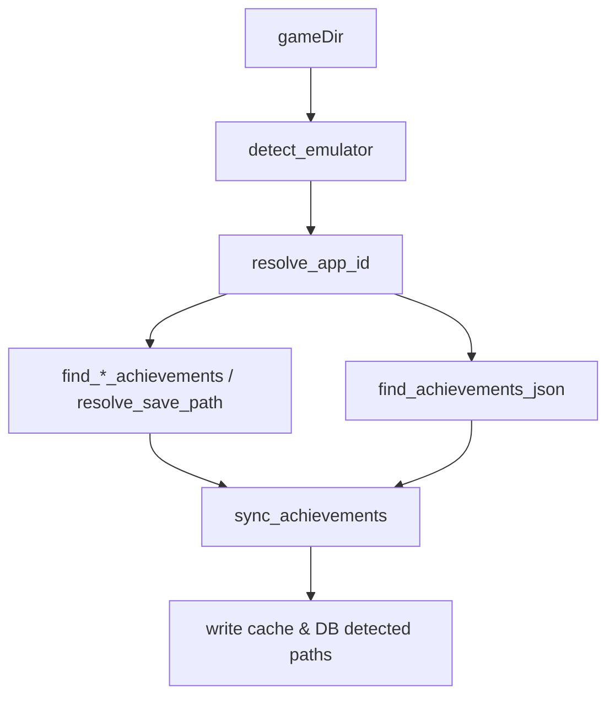

## High-level goals

- **Unify detection logic** for emulators (CODEX, Goldberg, Anadius, others) and app IDs so it matches the Python script’s behavior and is easy to reason about.
- **Rebuild the game scanning + add-game pipeline** so that crack/emulator type, app ID/content ID, and inferred install directory are consistently propagated from scanner → DB → frontend.
- **Rebuild achievement discovery & syncing** around a clear, Python-like flow: find metadata, find save state, optionally generate achievements.json from Steam, then merge and cache.
- **Keep the achievement overlay and live unlock events working**, but simplify them where possible to align with the new core logic.

## Current architecture (concise recap)

- **Backend (Rust/Tauri)**
  - `commands/scanner.rs` scans directories for candidate executables, infers install dirs, and detects `CrackType` + app ID using heuristics.
  - `commands/game.rs` handles `add_game`, pushes to DB via `db::writer`, then calls `achievements::sync_achievements` with options.
  - `achievements/mod.rs` implements:
    - `resolve_app_id`, `find_achievements_json`, `build_save_candidates`, `resolve_save_path`, `find_save_dir`.
    - `sync_achievements` to merge metadata JSON + emulator save state + cache.
  - `achievement_watcher.rs` watches emulator save files, emits `achievement-unlocked` and `achievement-save-discovered` events, and can auto-generate metadata from Steam.
  - `commands/achievements.rs` exposes `get_achievements`, `sync_game_achievements`, `check_local_achievements`, and `get_achievement_diagnostics` to the frontend.
  - `db/schema.rs`, `db/queries.rs`, `db/writer.rs` persist games and detected achievement paths.
- **Frontend (React/TS)**
  - `AddGameModal` and `DirectoryScannerModal` collect exe paths and metadata, then call `add_game` with `NewGame`.
  - `gameStore` and `gameService` manage games and launch flow; `GameDetailPage` orchestrates achievement syncing, diagnostics, and manual overrides.
  - `achievementService` wraps Tauri achievement commands; `AchievementGrid` and `RepackAchievementGrid` render the data.
  - Overlay components (`AchievementOverlay`, `AchievementToast`) display unlock toasts from Tauri events.

## Target architecture aligned with the Python script

### 1. Core detection & model layer

- **Create a central `EmulatorDetection` module (Rust)**
  - Refactor/replace `CrackType`, `detect_crack`, and `resolve_app_id` so that they:
    - Mirror the Python script’s behavior: look for Anadius, CODEX (`steam_emu.ini`, `.cdx`, `steam_appid.txt`), Goldberg (`steam_settings`, `steam_api.dll`), with clear precedence.
    - Produce a unified `EmulatorInfo` struct: `{ crack_type, app_id, confidence, markers }`.
    - Remain extensible for additional emulators (ALI213, CreamAPI, etc.) without leaking complexity into higher layers.
  - Keep code cross-platform-aware: gate Windows-specific path logic behind `cfg!(windows)` while structuring functions so non-Windows builds either no-op or follow a reduced path.
- **Standardize a `GameScanResult` model**
  - Replace/adapt `ScannedGame` in `scanner.rs` to:
    - Include: `executable_path`, `install_dir`, `guessed_title`, `emulator` (CrackType), `app_id`, and maybe a `score`.
    - Match what the Python script’s `scan_game` returns structurally (minus its interactive shell bits), so it’s easy to compare behavior.
  - Update `scan_directory` to:
    - Use a `score_exe` function extremely close to the Python’s `score_exe` (priority/skip keywords, depth bonus) while integrating existing `score_executable` strengths.
    - Always run emulator detection against the inferred game root and attach `EmulatorInfo` onto each result.

### 2. Game scanning and add-game pipeline

- **Backend: scanner refactor (`commands/scanner.rs`)**
  - Align core heuristics with the Python script:
    - Share skip and priority keyword sets with the Python version (e.g., `setup`, `unins`, `redist`, `vcredist`, `dxsetup`, `_commonredist`, and `64`, `dx12`, `shipping`).
    - Prefer exes close to the game root (`find_best_exe` analogue) and penalize deep directory structures.
  - Ensure `scan_directory` returns fully populated `GameScanResult` structs to Tauri.
- **Frontend: Directory scanner modal (`DirectoryScannerModal.tsx`)**
  - Extend TS `ScannedGame` type to match backend `GameScanResult`:
    - Add `crack_type: "codex" | "goldberg" | "anadius" | "unknown"` and `app_id: string | null`.
  - Update the UI to surface emulator/app-id information (optional but helpful for debugging): small badges or tooltips per scanned entry.
  - When user imports games, build `NewGame` including:
    - `crack_type` (stringified `CrackType`).
    - `app_id` (from scanner or null).
    - `install_dir` from scan result’s game root.
- **Frontend: Manual add modal (`AddGameModal.tsx`)**
  - After the user selects an exe, run the backend emulator detection on the selected folder:
    - Introduce a lightweight `detect_emulator_for_path(executable_path)` command or reuse existing detection.
    - Pre-populate `NewGame` with `crack_type` and `app_id` when available (can be read-only fields in the UI).
- **Backend: add-game command (`commands/game.rs`)**
  - Make `add_game` treat `NewGame.crack_type` and `NewGame.app_id` as first-class citizens:
    - Normalize the string into `CrackType`.
    - Use `app_id` as the initial known app-id, falling back to `resolve_app_id` only if null.
  - Ensure `add_game` consistently triggers `sync_achievements` with `SyncOptions.crack_type` and `SyncOptions.known_app_id` from the newly persisted game, not just from frontend metadata.
- **DB models/schema (`db/queries.rs`, `db/schema.rs`)**
  - Keep existing columns (`crack_type`, `app_id`, `detected_metadata_path`, `detected_earned_state_path`).
  - Verify/adjust constraints so they can store all emulator variants from the Python script (string-based app-id, ContentId, etc.).
  - Optionally add an `emulator_confidence` field if we want to expose detection uncertainty.
- **Frontend: types (`types/game.ts`)**
  - Extend TS `Game` and `NewGame` to include:
    - `crack_type?: string | null` and `app_id?: string | null`.
    - `detected_metadata_path?: string | null` and `detected_earned_state_path?: string | null` (read-only from backend).
  - Update `gameStore.fetchGames` and any components that assume the `Game` shape (non-breaking: just additive fields).

### 3. Achievement discovery, syncing, and Steam fetch

- **Backend: simplify + align `achievements/mod.rs` with Python script**
  - Model the flow after `scan_game` + `find_*_achievements` + `fetch_achievements_json`:

- Reorganize helper functions into clear phases:
  - **Phase 1** – App-id & emulator: use unified `EmulatorInfo` from the core module.
  - **Phase 2** – Metadata discovery: find `achievements.json` using a sequence of candidate locations matching the Python script’s logic and your additional existing heuristics.
  - **Phase 3** – Save discovery: build candidate save paths by emulator (CODEX/Goldberg/Anadius) and scan roots.
  - **Phase 4** – Earned state parsing: map `.ini`/`.json`/`.xml` to a unified `EarnedMap` (api_name/display_name → timestamp).
  - **Phase 5** – Merge + cache: construct `Achievement` list, store in cache, and persist `detected_metadata_path` + `detected_earned_state_path` in DB.
- **Steam API-based generation**
  - Keep `try_auto_generate` + `achievement_watcher::generate_achievements_json`, but:
    - Ensure behavior matches Python’s `fetch_achievements_json`: generate `achievements.json` only when metadata is missing, and write to per-emulator save directory.
    - Normalize the JSON shape to match what the Python script writes (fields: `name`, `displayName`, `description`, `hidden`, `icon`, `icongray`).
- **Commands bridging to frontend**
  - Keep the signatures of:
    - `get_achievements`, `sync_game_achievements`, `check_local_achievements`, `get_achievement_diagnostics`.
  - Adjust their internal logic to call the new structured pipeline, not legacy helpers, while:
    - Preserving response types for the frontend.
    - Enriching `AchievementDiagnostics` with emulator info & candidate paths that match the Python-style outputs.

### 4. Overlay and launch integration

- **Launch path (`commands/launcher.rs`)**
  - Update `show_overlay_and_start_watcher` to use the new `EmulatorInfo` and achievement discovery pipeline:
    - Use `EmulatorInfo` for both deciding whether to show an emulator badge and where to watch for saves.
    - Prefer persisted `games.detected_*_path` when available, falling back to a lightweight re-run of the detection pipeline.
- **Watcher module (`achievement_watcher.rs`)**
  - Keep the event model stable (`achievement-unlocked`, `achievement-save-discovered`) so the overlay UI does not break.
  - Simplify watcher bootstrap:
    - Given `EmulatorInfo` and discovered `save_path`/`metadata_path`, start a single watcher with a uniform `WatcherConfig` instead of many emulator-specific entrypoints.
    - Retain emulator-specific parsing (INI/JSON/XML) but let the new core discovery module decide the paths.
  - Ensure cross-platform behavior:
    - Watchers are no-op or limited on non-Windows, but keep code structured so future Linux support can plug in different paths.
- **Frontend overlay (`AchievementOverlay`, `AchievementToast`)**
  - Leave UX and event handling mostly intact.
  - Optionally add subtle emulator/app-id hints in toast debug UI if that helps debugging (reading fields from unlock payload or diagnostics, not required for core behavior).

### 5. Diagnostics, developer tooling, and UX

- **Diagnostics improvements**
  - Enhance `get_achievement_diagnostics` to:
    - Return a summary that mirrors Python’s `scan_game` printout: emulator, app-id, save folder, achievements.ini/json/xml paths, and whether a Steam fetch was attempted.
    - Include a `probing_steps` string that explains the detection chain (helpful when a game is misconfigured).
- **Frontend: Game detail diagnostics panel**
  - Rework the diagnostics section in `GameDetailPage` to visually mirror the Python script’s console output structure:
    - Show emulator & app-id prominently.
    - Show detected save and metadata paths.
    - Indicate whether achievements were generated via Steam API vs local files.
  - Keep manual override UX (`Set path`, `Clear override`), but ensure overrides feed directly into the new pipeline’s `manual_path` handling.

### 6. Migration & compatibility strategy

- **Preserve DB data**
  - Do *not* drop or radically change game/achievement-related columns.
  - Run the new detection pipeline lazily:
    - On first launch after upgrade, for each existing game, schedule a background re-scan that:
      - Fills in `crack_type`/`app_id` if missing.
      - Fills or corrects `detected_metadata_path`/`detected_earned_state_path`.
- **Feature flags / logging**
  - Add verbose logging (or a debug setting) around emulator and achievement detection so you can compare Rust behavior with your Python script on real installs.
  - Optionally add a temporary command `debug_scan_game_path(path)` that runs the core detection pipeline and returns a JSON payload identical in shape to the Python script’s `scan_game` result for easy side-by-side comparison.

## Todos

- **scan-backend-refactor**: Refactor `commands/scanner.rs` to use a unified `EmulatorInfo` model, Python-like `score_exe`, and a richer `GameScanResult` with emulator and app-id.
- **frontend-scanner-wireup**: Extend `DirectoryScannerModal` and `AddGameModal` to capture and pass through `crack_type`, `app_id`, and `install_dir` into `NewGame`.
- **db-model-alignment**: Verify and adjust `Game`/`NewGame` structs and `games` table schema to cleanly store emulator/app-id and detected paths without breaking existing data.
- **achievements-core-rewrite**: Rebuild `achievements/mod.rs` around the phased pipeline (detect emulator/app-id, discover metadata & save, merge, cache, Steam fetch) modeled on the Python script.
- **watcher-integration-update**: Simplify `achievement_watcher.rs` to consume the new discovery results while preserving event shapes, and wire it through `launcher.rs`.
- **diagnostics-and-ui**: Enhance `get_achievement_diagnostics` and corresponding GameDetail diagnostics UI to surface the new detection info and match the Python script’s clarity.

